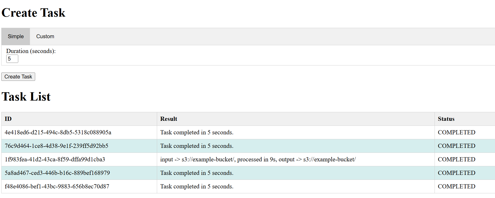
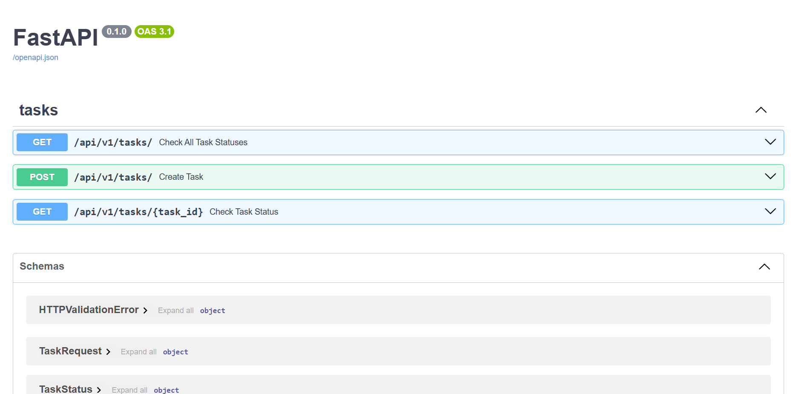
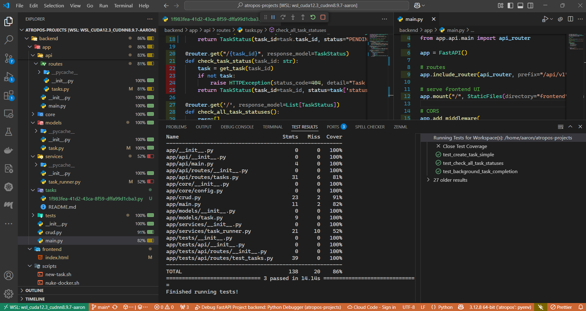

# START HERE
- First, clone the project GitHub repo:
 
      git clone git@github.com:miramar-labs/atropos-projects.git

- Next, ensure you have the required toolchain:
  - [Docker](https://www.docker.com/)
  - [Docker Compose v2](https://docs.docker.com/compose/)
  
# Build & Run Solution
- Build the Docker containers:

      cd atropos-projects/backend
      docker compose build

- Run the containers:

      cd atropos-projects/backend
      docker compose up

  (you can watch logs from here and when done, stop everything with CTRL-C)

- Load the frontend UI in a browser tab:

      http://localhost:8000

- Load the REST API Swagger in another tab:

      http://localhost/8000/docs

- Run tests (from commandline):

  - First, start REDIS (if not already running):
  
            cd atropos-projects/backend
            docker compose up redis

  - Now run the tests:

            pytest

  - Alternatievly you can run/debug tests with coverage from vscode:

  

# Application Notes

- The application implements a basic REST API to manage tasks using FastAPI.
- The API is asynchronous, so that it can manage long running tasks without blocking/waiting for results.
- Tasks are identified by unique id's (UUID's)
- Task status/results can be polled for as needed by the client.
- Task state is persisted to a scalable REDIS store.
- The app and REDIS are packaged as Docker containers.
- Tests and coverage are implemented using pytest tooling.
- A simple frontend UI is implemented in HTML/javascript.
- API documentation is auto-generated by FastAPI as Swagger.
- The UI can be used to fire off two kinds of tasks:
 
    - *Simple*: a task that runs in the background for a specified number of seconds.
  
    - *Custom*: by specifying a UUID, the app will look for a python script named `app/tasks/<uuid>.py` and attempt to run it in the background. An optional 'uri' arg can be passed to the task, which could be used by the task to locate any input artifacts it needs (in an S3 bucket for example)...the task returns a result string (which could also be an S3 bucket uri containing result arifacts).
- Improvements & production deployment considerations:
  - Cloud: 
      - Kubernetes as a base platform for HA and multi-cloud portability.
        - Scalability:
          - REDIS is scalable vertically and horizontally
          - Deploy a Load balancer - NGINX
          - H-scale out app deployments as needed behind LB.
        - Monitoring/Logging:
          - Prometheus/Grafana
  - Security:
    - HTTPS/TLS - encrypt all data over the wire or at rest.
    - KeyVault for secrets
  - Task scheduling:
    - Use a distributed task queue such as [Celery](https://github.com/celery/celery) for this
  - CI/CD
    - Use whatever is native to the Cloud provider you are using.
  - Open Source solutions:
    - [Apache AirFlow](https://airflow.apache.org/) would be a great choice for this if you don't want to roll your own.

# Configure Development Environment [optional]:
  
- [Install vscode](https://code.visualstudio.com/)

  - Install extensions:
   
    - Docker (microsoft)
    - Python (microsoft)
    - PyLance (microsoft)
    - Python Debugger (microsoft)
  
  
- [Install pyenv](https://github.com/pyenv/pyenv)
  
- Then create a python virtual environment:
  
        pyenv install 3.12.8
        pyenv virtualenv 3.12.8 atropos
        
        cd atropos-projects
        pyenv local 3.12.8

        cd backend
        pip install -r requirements.txt

- Run `vscode` and open the `atropos-projects` folder